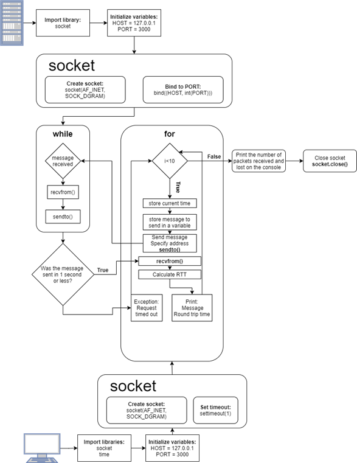

# Client to Server Ping Program

## Problem Definition

The task was to write a client to server ping program. The client sends 10 messages to the server and receives a message back. The Round Trip Time (RTT) it took between the client to the server and back is calculated. This should be implemented using UDP as its Transport layer protocol. Any message that exceeds one (1) second is considered lost and a "Timed out" message will be printed.

## Design Flowchart

Even though port 3000 is being used, you can change it to avoid any conflict with your existing runtimes/services using said port. Loopback interface can be changed to any existing IP. For the purposes of this task, localhost was used.



## Output

```shell
PING Wed Mar 10 11:41:24 2021
Round Trip Time: 0.30

PING Request timed out

PING Wed Mar 10 11:41:24 2021
Round Trip Time: 0.35

PING Wed Mar 10 11:41:25 2021
Round Trip Time: 0.06

PING Request timed out

PING Wed Mar 10 11:41:25 2021
Round Trip Time: 0.69

PING Request timed out

PING Wed Mar 10 11:41:25 2021
Round Trip Time: 0.04

PING Wed Mar 10 11:41:26 2021
Round Trip Time: 0.60

PING Request timed out

Packets received: 6
Packets lost: 4
```
